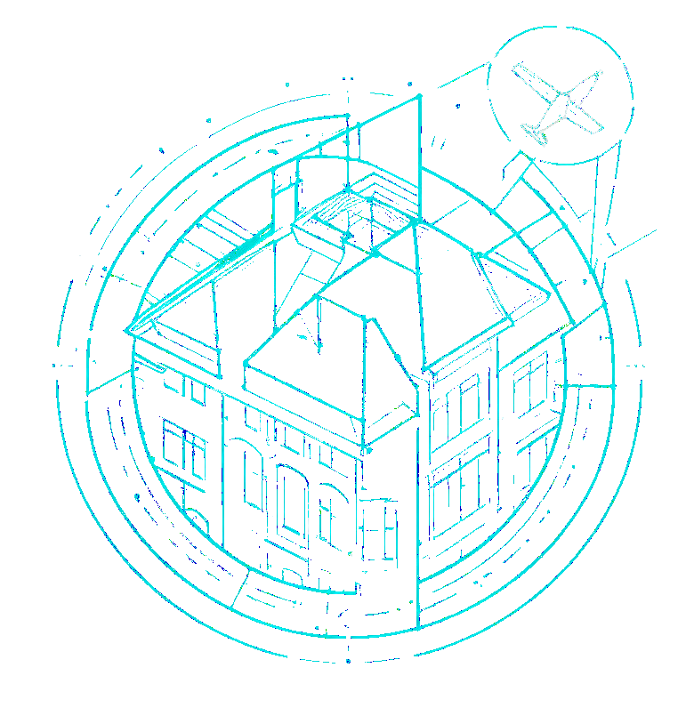
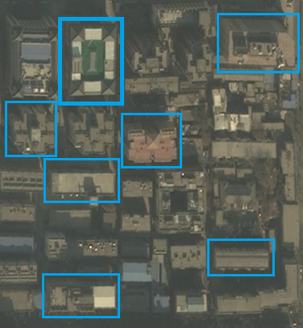
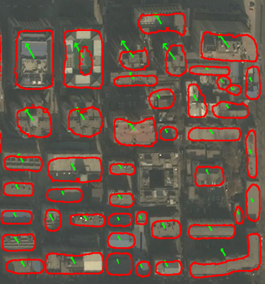
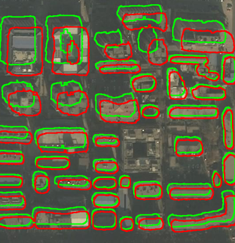
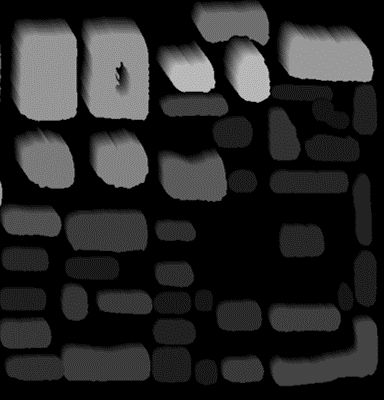

# TGRS preprint paper

We have two contributions: 

1) we first introduced the "Offset Token" concept and its decode-encode methods. This is a very big contribution, which brings the former method in BFE into the era of the Transformer and Foundation Models.
   
2) We newly discovered a common pattern of predicting offsets. 
<!-- Improved compatibility of back to top link: See: https://github.com/othneildrew/Best-README-Template/pull/73 -->
<a name="readme-top"></a>
<!--
*** Thanks for checking out the Best-README-Template. If you have a suggestion
*** that would make this better, please fork the repo and create a pull request
*** or simply open an issue with the tag "enhancement".
*** Don't forget to give the project a star!
*** Thanks again! Now go create something AMAZING! :D
-->


<!-- PROJECT SHIELDS -->
<!--
*** I'm using markdown "reference style" links for readability.
*** Reference links are enclosed in brackets [ ] instead of parentheses ( ).
*** See the bottom of this document for the declaration of the reference variables
*** for contributors-url, forks-url, etc. This is an optional, concise syntax you may use.
*** https://www.markdownguide.org/basic-syntax/#reference-style-links
-->
<!-- [![Contributors][contributors-shield]][contributors-url] -->

[![MIT License][license-shield]][license-url]


<!-- PROJECT LOGO -->
<br />
<div align="center">
  <a href="https://github.com">
    
  </a>

  <h3 align="center">Extract Building Footprint from Aerial Images with Offset-Building Model (OBM)</h3>

  <p align="center">
    Extract building footprint like a human
    <br />
    <a href="https://github.com/"><strong>Explore the docs »</strong></a>
    <br />
    <br />
    <a href="https://github.com/">View Demo</a>
    ·
    <a href="https://github.com/issues">Report Bug</a>
    ·
    <a href="https://github.com/issues">Request Feature</a>
  </p>
</div>


<!-- TABLE OF CONTENTS -->
<details>
  <summary>Table of Contents</summary>
  <ol>
    <li>
      <a href="#What is OBM?">What is OBM?</a>
      <ul>
        <li><a href="#built-with">Built With</a></li>
      </ul>
    </li>
    <li>
      <a href="#getting-started">Getting Started</a>
      <ul>
        <li><a href="#prerequisites">Prerequisites</a></li>
        <li><a href="#installation">Installation</a></li>
      </ul>
    </li>
    <li><a href="#usage">Usage</a></li>
    <li><a href="#Workflow and Results">Results</a></li>
    <li><a href="#license">License</a></li>
    <li><a href="#contact">Contact</a></li>
  </ol>
</details>


<!-- ABOUT THE PROJECT -->
## What is OBM?

<!-- [![Product Name Screen Shot][product-screenshot]](https://example.com) -->
| ![Product Name Screen Shot][product-screenshot] | ![Product Name Screen Shot][ROAM-screenshot] |
| :---: | :---: |
| (a) OBM Model | (b) ROAM module |

We first proposed a novel interactive model for footprint extraction and designed a series of Distance NMS algorithms tailored for the Building Footprint Extraction (BFE) problem. We also designed new metrics to measure the interactive BFE model.  

Based on our accurate extraction of the roof and root-to-footprint offset. We can rebuild buildings' relative height maps. 

**(a)** illustrates our  structure which inherits from the Segment Anything Model (SAM). 

**(b)** gives out the structure of our core module, Reference Offset Adaptive Module (ROAM). During inference, based on the results of the base offset head, each building will classified by its length and then roam to the adaptive head. The final result is determined by the Basehead and adaptive head.   


Our model reaches new SOTA:
* A clear drop of offset error by 16.99%, increase roof boundary iou by 13.15%, on open dataset BONAI. 
* Without extra training, we tested all models on a newly annotated dataset for generalization, improving 20.29% in vector and 76.36% in offset angle. 
* DNMS series can bring extra gain in all situations. 

<p align="right">(<a href="#readme-top">back to top</a>)</p>


### Built With

Our work is based on the following:

-  [pytorch]
-  [MMDetection]
-  [BONAI]
-  [SAM]
<p align="right">(<a href="#readme-top">back to top</a>)</p>
Our weight of OBM is available at <a href="https://1drv.ms/u/c/4714078bb90d0216/EbVLDOlRwlZHr5h60nC3HuoBk1QrRFc6QqY_oXPCz-_3nA?e=Xbe1Qc" title="OBM_weight">OBM weight</a>.  


<!-- GETTING STARTED -->
## Getting Started

This is a quick start of OBM. 

### Prerequisites

The code is built on the old version of mmdetection, and trained with a server that has 6x RTX3090.     
* ensure you have the correct CUDA and compatible torch version
  ```sh
  nvidia-smi
  ```
Our runnable environments:
 `pytorch 1.7.0, CUDA 11.1`


### Dataset
Downloads training images and test images from [BONAI]. We newly added building segementation label in our newly launched dataset which are avaliable with [Huizhou] together. 

### Installation

NOTE: Please follow the installation of [BONAI] and the early edition of [MMdetection].


<!-- USAGE EXAMPLES -->
## Usage

* Train on your own dataset:
```bash
bash tools/dist_train.sh configs/obm_seg_fintune/smlcdr_obm_pretrain.py 6 # train with ROAM
bash tools/dist_train.sh configs/obm_seg/obm_seg_b.py 6 # train without ROAM
```

* Inference your dataset:
```bash
python tools/test_offset.py --config configs/obm_seg/obm_seg_b.py
```

_``WARNING: OUR TRAINING DOES NOT SUPPORT FINETUNE LIKE LORA, BACKBONE IS INCLUDED, PLEASE SET `samples_per_gpu = 1` !!!``_

_``WARNING: PLEASE SET `samples_per_gpu = 1` WHILE INFERENCING !!!``_

* Improve offset quality:

```bash
# using function fixangle()
## parameter: model = 'max' represents DNMS
## parameter: model = 'guassia_std' represents soft-DNMS

python tools/postprocess_offset.py 
```

* Visualize your results:
```bash

# we provide two kinds of visualizing functions: 
## 1: vis_3d() for relative height maps. 
## 2:  vis_boundary_offset: for roof and footprint boundary. 
python tools/visual_offset.py 

# if you want to visualize the results of LOFT in BONAI
python tools/visual_instance_seg.py

```
<p align="right">(<a href="#readme-top">back to top</a>)</p>


<!-- ROADMAP -->
## Workflow and Results
Our model  simulates the process of how a human annotates a footprint. 

### 1. At the **`first`** stage, we input an image with some prompts to imply buildings' rough location, using box prompts as an example:
<div align=center>
  
</div>

### 2. **`Then`** Our OBM will give out roof segmentation and a roof-to-footprint offset for each prompt. 
<div align=center>
  
</div>

### 3. **`Finally`**, we drag the roof to its footprint via the offset. 

* We provide two kinds of operation: one is to directly get **footprints**, and the other is to get the **relative height maps**. 
<div align=center>
   
</div>

<p align="right">(<a href="#readme-top">back to top</a>)</p>


<!-- LICENSE -->
## License

Distributed under the MIT License. See `LICENSE.txt` for more information.

<p align="right">(<a href="#readme-top">back to top</a>)</p>


<!-- CONTACT -->
## Contact

<p align="right">(<a href="#readme-top">back to top</a>)</p>
Offset tokens are hard to train; they are very sensitive to the settings. 
If you have any problems training the offset tokens, please contact me by likai211#mails.ucas.ac.cn or kaili37-c#my.cityu.edu.hk. 
I think my experience of failure in training will help you train your model.
You can also contact me for any building-related problem or collaboration. 


## Citing
```
@ARTICLE{obm,
  author={Li, Kai and Deng, Yupeng and Kong, Yunlong and Liu, Diyou and Chen, Jingbo and Meng, Yu and Ma, Junxian and Wang, Chenhao},
  journal={IEEE Transactions on Geoscience and Remote Sensing}, 
  title={Prompt-Driven Building Footprint Extraction in Aerial Images with Offset-Building Model}, 
  year={2024},
  volume={},
  number={},
  pages={1-1},
  keywords={Buildings;Prediction algorithms;Production;Data models;Data mining;Remote sensing;Instance segmentation;Feature extraction;Training;Three-dimensional displays;Building footprint extraction;Roof segmentation;Roof-to-footprint offset extraction;Segment Anything Model (SAM);Non-Maximum Suppression(NMS)},
  doi={10.1109/TGRS.2024.3487652}}
```


<!-- MARKDOWN LINKS & IMAGES -->
<!-- https://www.markdownguide.org/basic-syntax/#reference-style-links -->
[contributors-shield]: https://img.shields.io/github/contributors/othneildrew/Best-README-Template.svg?style=for-the-badge
[contributors-url]: https://github.com/
[forks-shield]: https://img.shields.io/github/forks/othneildrew/Best-README-Template.svg?style=for-the-badge
[forks-url]: https://github.com/network/members
[stars-shield]: https://img.shields.io/github/stars/othneildrew/Best-README-Template.svg?style=for-the-badge
[stars-url]: https://github.com/stargazers
[issues-shield]: https://img.shields.io/github/issues/othneildrew/Best-README-Template.svg?style=for-the-badge
[issues-url]: https://github.com/issues
[license-shield]: https://img.shields.io/github/license/othneildrew/Best-README-Template.svg?style=for-the-badge
[license-url]:https://github.com/likaiucas/OBM/blob/main/LICENSE.txt
[product-screenshot]: images/model2.png
[ROAM-screenshot]: images/ROAM.png
[Next.js]: https://img.shields.io/badge/next.js-000000?style=for-the-badge&logo=nextdotjs&logoColor=white
[Next-url]: https://nextjs.org/
[React.js]: https://img.shields.io/badge/React-20232A?style=for-the-badge&logo=react&logoColor=61DAFB
[React-url]: https://reactjs.org/
[Vue.js]: https://img.shields.io/badge/Vue.js-35495E?style=for-the-badge&logo=vuedotjs&logoColor=4FC08D
[Vue-url]: https://vuejs.org/
[Angular.io]: https://img.shields.io/badge/Angular-DD0031?style=for-the-badge&logo=angular&logoColor=white
[Angular-url]: https://angular.io/
[Svelte.dev]: https://img.shields.io/badge/Svelte-4A4A55?style=for-the-badge&logo=svelte&logoColor=FF3E00
[Svelte-url]: https://svelte.dev/
[Laravel.com]: https://img.shields.io/badge/Laravel-FF2D20?style=for-the-badge&logo=laravel&logoColor=white
[Laravel-url]: https://laravel.com
[Bootstrap.com]: https://img.shields.io/badge/Bootstrap-563D7C?style=for-the-badge&logo=bootstrap&logoColor=white
[Bootstrap-url]: https://getbootstrap.com
[JQuery.com]: https://img.shields.io/badge/jQuery-0769AD?style=for-the-badge&logo=jquery&logoColor=white
[JQuery-url]: https://jquery.com 

[Huizhou]: https://portland-my.sharepoint.com/:f:/g/personal/kaili37-c_my_cityu_edu_hk/Ep2EnO01ZghPuebKASl5h60BUjbBvrbiSHKoSiwfIBYBNg?e=7hdlzQ

[OBMweight]: https://1drv.ms/u/c/4714078bb90d0216/EbVLDOlRwlZHr5h60nC3HuoBk1QrRFc6QqY_oXPCz-_3nA?e=Xbe1Qc
[pytorch.org]: https://pytorch.org
[MMDetection.git]: https://github.com/open-mmlab/mmdetection
[pytorch]: https://pytorch.org
[MMDetection]: https://github.com/open-mmlab/mmdetection
[BONAI.git]: https://github.com/jwwangchn/BONAI
[BONAI]: https://github.com/jwwangchn/BONAI
[SAM]: https://github.com/facebookresearch/segment-anything
